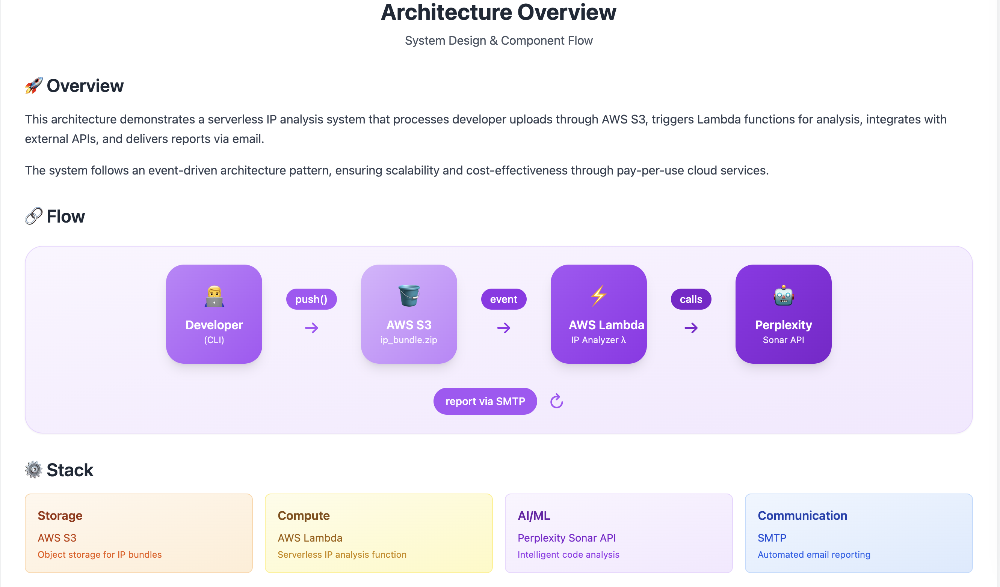

# DLyog IP Checker

DLyog IP Checker is an automated system for validating software code bundles against potential **Intellectual Property (IP) risks** such as copyright, patent, and trademark violations. It uses an **AWS Lambda** backend triggered via **S3 file upload events**, with email reporting and **AI analysis powered by Perplexity's Sonar model**.



## 🏗️ Architecture Overview

* **CLI Tool (`cli/`)**: Prepares and uploads your project source bundle to S3.
* **AWS S3**: Stores the uploaded `ip_bundle.txt`. Triggers the Lambda function.
* **Lambda Function (`lambda/handler.py`)**: Processes the uploaded bundle using the Perplexity Sonar API, and sends results via email.
* **GitHub Actions (`.github/workflows/`)**:

  * `1_deploy_infra.yml`: Creates S3 bucket, Lambda role, permissions.
  * `2_deploy_lambda.yml`: Packages and deploys the Lambda code.

## 🧰 Folder Structure

```
.
├── cli/                     # CLI commands (push to S3, etc.)
├── infra/                   # Infrastructure-as-code scripts
├── lambda/                  # Lambda function handler
├── .github/workflows/       # GitHub Actions
├── config-template.json     # Template config for CLI use
├── requirements.txt         # Python dependencies
└── theme.png                # Optional image asset
```

## 🛠️ Setup Instructions

### 1. Clone the repository

```
git clone https://github.com/YOUR_ORG/dlyogip-checker.git
cd dlyogip-checker
```

### 2. Set up a self-hosted GitHub Runner

Follow GitHub's [guide](https://docs.github.com/en/actions/hosting-your-own-runners/about-self-hosted-runners) to register a self-hosted runner tagged with:

```
self-hosted, Linux, X64, aws, ipchecker
```

### 3. Add Repository Secrets

Set the following secrets in your GitHub repo under **Settings → Secrets → Actions**:

| Secret Name             | Description                               |
| ----------------------- | ----------------------------------------- |
| `AWS_ACCESS_KEY_ID`     | IAM user key with Lambda & S3 permissions |
| `AWS_SECRET_ACCESS_KEY` | Corresponding secret                      |
| `API_SECRET_KEY`        | Used for authenticating (optional legacy) |
| `PERPLEXITY_API_KEY`    | Your Perplexity Sonar API key             |
| `SMTP_HOST`             | SMTP host for sending report emails       |
| `SMTP_PORT`             | SMTP port (usually 587)                   |
| `SMTP_USER`             | SMTP username                             |
| `SMTP_PASSWORD`         | SMTP password                             |
| `TO_EMAIL`              | Email address to send the report to       |

### 4. Deploy the Infrastructure

Run the following GitHub Action manually:

> `.github/workflows/1_deploy_infra.yml`

This will:

* Create the S3 bucket
* Create the Lambda IAM Role
* Set up S3 Event triggers

### 5. Deploy the Lambda Code

Run the second GitHub Action:

> `.github/workflows/2_deploy_lambda.yml`

This will:

* Package `lambda/handler.py`
* Upload it to S3
* Create/update the Lambda function
* Configure environment variables

## 🚀 Running the IP Check

From your local machine:

```
python cli/dlyogipchecker.py push "$PROJECT_FOLDER_PATH"
```

This will:

* Bundle all relevant source files (`*.py`, `*.md`)
* Upload it to `s3://dlyogipchecker-bucket/ip_bundles/ip_bundle.txt`
* Automatically trigger the Lambda analysis and send results to the configured `TO_EMAIL`

## 📝 Disclaimer

> This project uses an AI model to assist with intellectual property risk identification. The results may contain inaccuracies. For legally binding advice or professional review, consult a qualified IP attorney.
